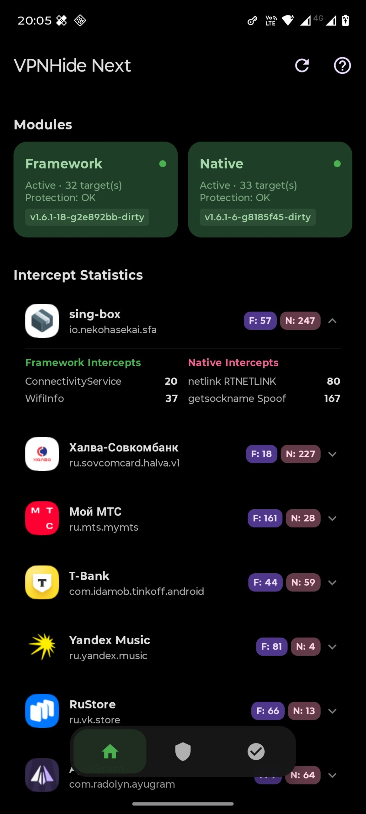
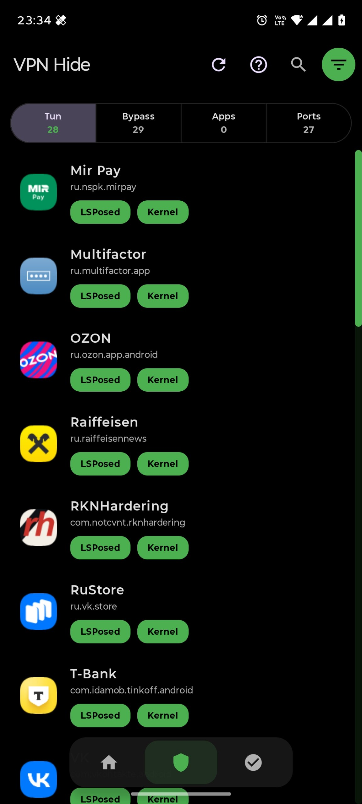
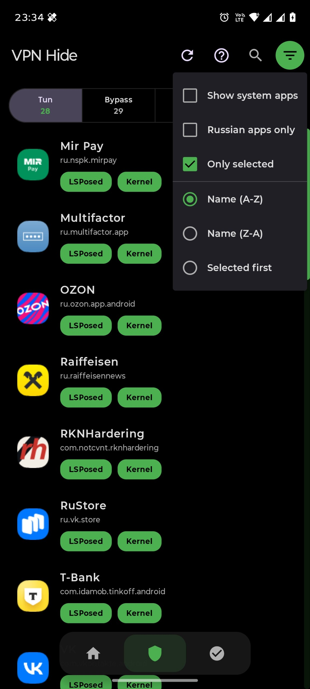
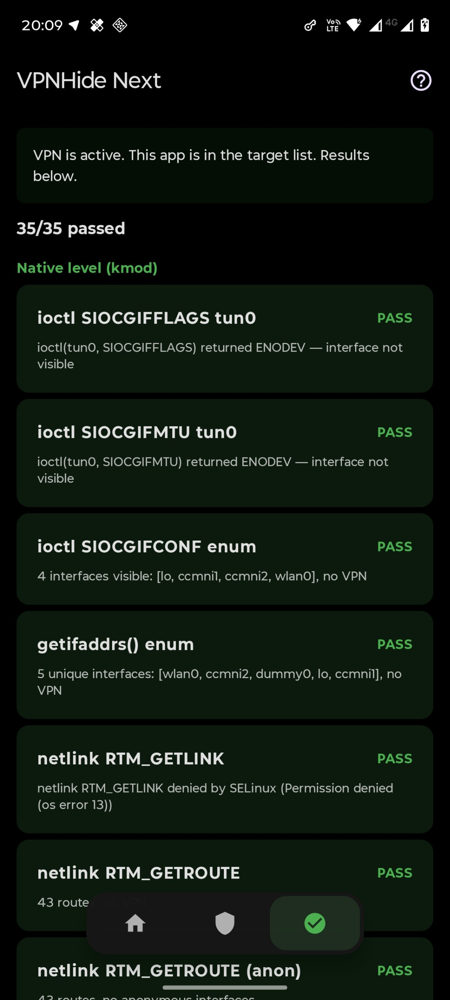
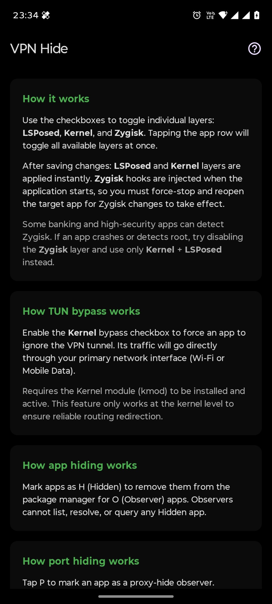

  

<h1 align="center">VPNHide Next</h1>

Hide an active Android VPN connection from selected apps.

  
  
  
  

<strong><a href="README.md">Русская версия</a></strong>

**vpnhide** is a tool to hide VPN usage from Android applications. It makes the VPN connection invisible even to services that actively try to detect it (such as banking apps, streaming platforms, or region-restricted services).

**Main differences from the original (in brief):**
*   **Dropped Zygisk**: The module is strictly focused on zero-in-process stealth via kmod + LSPosed.
*   **In-Kernel Port Blocking**: Loopback blocking is moved from iptables to `security_socket_connect` kernel hooks.
*   **Surgical Mimicry in LSPosed**: VPN properties are substituted with active physical network properties in `system_server` rather than suspicious data blanking.
*   **New Native Vectors**: Spoofing of `getsockname`, MTU/MSS clamping, setsockopt binds, and RPDB policy routing.
*   **16+ Advanced Detection Vectors Covered**: Unlike the original (which only covers basic interface lists), Next natively blocks:
    1. Local socket addresses (`getsockname` IPv4/IPv6 in `inet_getname`).
    2. Direct binds to VPN interface (`SO_BINDTODEVICE` in `sock_setsockopt`).
    3. Low MTU and TCP MSS clamping (`getsockopt` / `TCP_MAXSEG` / `IP_MTU`).
    4. UDP Path MTU Discovery (`IP_MTU_DISCOVER` option / blocking `EMSGSIZE` leak).
    5. Localhost SOCKS/HTTP port bind conflicts (`bind()` to 127.0.0.1 in `security_socket_bind`).
    6. System policy routing database checks (`RTM_GETRULE` via Netlink).
    7. Reactive Java network status changes (`NetworkCallback` in `system_server`).
    8. Wi-Fi redaction issues (`WifiInfo` SSID/BSSID/IP restoration), Network NetID leaks, and other low-level channels.
*   **Absolute Stealth**: Complete removal of ProcFS (files in `/proc/`) in favor of a secure char device `/dev/vpnhide_ctrl`.
*   **Work Profiles Support**: Full native profile filtering and separation.
*   **Modern DB Engine**: Driven by Room (SQLite) database with automatic inotify reload.
*   **ARM64 Only**: Dropped support for legacy architectures and optimized for arm64-v8a.
*   **Intercept Statistics Monitoring (Native & Framework)**: Real-time, lazy-loaded statistics of all blocked and spoofed calls with details on specific Java framework APIs and native syscall vectors (ioctl, netlink, getsockname, connect).

### Detailed comparison with the original (in detail)

| Detection Vector / Feature | Original vpnhide (okhsunrog) | VPNHide Next (This fork) | Hiding Approach & Advantages |
| :--- | :--- | :--- | :--- |
| **Operation Level & Process Footprint** | Zygisk (injection into target process) / LSPosed / kmod | **Only kmod (Kernel) + LSPosed (system_server)** | **Absolute Stealth**: No memory injections, libraries, or hooks in the target process context. Prevents detection by advanced Anti-Tamper/Anti-Cheat memory scanners (MirPay, banking apps). |
| **Java Hiding Philosophy (LSPosed in system_server)** | **Brute-Force Removal (Interface Cutting)**: VPN interfaces and routes are deleted or nulled out in structures. | **Surgical Mimicry**: Replaces `tun0` / VPN name with active physical interface (`wlan0`/`rmnet_data0`), clones and projects physical `LinkAddresses`, `Dnses`, `Domains`, `Mtu`, and routes. | **Physical Interface Simulation**: Target application receives coherent, legimate network structures matching standard Wi-Fi/cellular properties (no anomalous zero-DNS/empty structures). |
| **Local Port Probing (Localhost / Loopback)** | External Magisk module `portshide` via `iptables` rules. | **Integrated Kernel Socket Connect Hook `security_socket_connect` (Hook 12)** | **No Network Footprint**: Port blocking (TCP/UDP, IPv4/IPv6, loopback subnets, wildcard addresses) is implemented inside the kernel. Leaves zero suspicious custom chains in `iptables`. |
| **Local Socket Address (`getsockname`)** | Missed (leaks the local IP address of the VPN gateway). | **Kernel-level address spoofing via `inet_getname` / `inet6_getname` (Hook 13)** | **Socket Mimicry**: Returns the real physical IP address (synchronized by a daemon) instead of the VPN-tunnel address to the target application. |
| **Direct Bind to VPN (`setsockopt` SO_BINDTODEVICE)** | Missed (application can bind sockets directly to the VPN interface). | **Bind Sabotage via `sock_setsockopt` (Hook 2b)** | **Anti-Bypassing**: Intercepts and sets `optlen = 0` for binds to VPN interfaces. Kernel treats it as "remove binding" and returns `0` (Success) to the application. |
| **MTU/MSS Clamping & UDP Path MTU** | Missed (lower MTU/MSS sizes or `EMSGSIZE` on larger UDP packets typical of VPN overhead leak presence). | **MTU/MSS & UDP PMTU Spoofing in `getsockopt` / `setsockopt` / `sock_common_getsockopt` (Hooks 2c, 2d, 1.6.1)** | **Packet Size & PMTUD Mimicry**: Overwrites `IP_MTU`/`IPV6_MTU` to 1500, `TCP_MAXSEG` to 1460, and intercepts `setsockopt` `IP_MTU_DISCOVER` (PMTU discovery) to block `EMSGSIZE` bottleneck anomalies. |
| **Local Proxy Detection (`bind()` to localhost)** | Missed (target app can detect active proxy/VPN listeners by receiving `EADDRINUSE` errors on known ports). | **Kernel-level bind spoofing via `security_socket_bind` (Hook 14)** | **Proxy Listener Spoofing**: Intercepts `bind()` to `127.0.0.1` on known VPN/proxy ports (SOCKS, HTTP, DNS). If the port is already in use by a VPN/proxy daemon, it returns `0` (Success) instead of `EADDRINUSE`, hiding the proxy listener completely. |
| **Routing Policy Database (RPDB / Netlink)** | Missed. | **Netlink `RTM_GETRULE` filtering (`fib_nl_fill_rule` / Hook 7b)** | Hidden policy routing database rules from target apps. |
| **DNS Queries / DNS Leaks** | VPN DNS servers could leak inside LinkProperties. | **Precision DNS Filtering** | Completely removes VPN DNS entries, replacing them with physical DNS properties or Google Public DNS (8.8.8.8). |
| **NetworkCallback Events** | Missed. | **Complete system-level suppression of VPN-specific callbacks** | Prevents targeted apps from receiving VPN status changes in AOSP network callbacks (e.g., `onAvailable`). |
| **Wi-Fi Scanning (WifiInfo Redaction)** | Missed. | **Physical IP/SSID/BSSID restoration (AOSP 12+)** | Restores real parameters anonymized by Android 12+ without location permission, bypassing telemetry checks (e.g. MTS). |
| **Network NetID Leak** | Missed (VPN network has a distinct network ID). | **Dynamic NetID Replacement** | Substitutes the VPN network NetID with the active physical NetID. |
| **FileSystem Stealth (ProcFS)** | Creates public `/proc/vpnhide_targets` and `/proc/vpnhide_debug` nodes. | **Absolute ProcFS-stealth via `/dev/vpnhide_ctrl` character device** | Completely removes `/proc` nodes. Root controller communicates via misc character device with `0660` permissions (root/system only), invisible to untrusted apps. |
| **Rules DB & Boot Performance** | Plaintext configuration files, slow startup parsing. | **SQLite (Room) database with `inotify` FileObservers** | Immediate loading and instantaneous, transaction-based rule synchronization. |
| **Work Profiles** | Not supported. | **Full Native Support** | Isolates and filters targets in secondary profiles and work profiles with profile separation. |
| **Intercept Statistics** | Absent. | **Comprehensive Native & Framework Stats** | **Full Visibility**: Real-time stats with lazy-loaded interface and detail views down to specific Java framework hooks and native vectors (ioctl, netlink, getsockname, connect). |

### Architecture
*   **`kmod`** — kernel module (recommended), operating outside the application process context. Requirements: GKI + ARM64-v8a.
*   **`lsposed`** — Binder transaction filtering in `system_server`. Optional.

### Installation
1.  Install `vpnhide.apk` and enable the module in LSPosed (scope: System Framework).
2.  Reboot your device.
3.  Install the kernel module (`kmod`) via the app.
4.  Select target apps in the "Protection" tab and save your settings.

### Screenshots
| Dashboard | App Selection | Sorting | Diagnostics |
|:-:|:-:|:-:|:-:|
|  |  |  |  |
| **Bulk Ports Rules** | **Local Ports Rules** | **Rules Validation** | **FAQ** |
|  |  |  |  |
| **Custom Tun Prefixes** | **Hook Isolation** | | |
|  |  | | |

---
### Project Information
This is a fork of the [okhsunrog/vpnhide](https://github.com/okhsunrog/vpnhide/) project. This branch was detached from the upstream due to significant changes.
