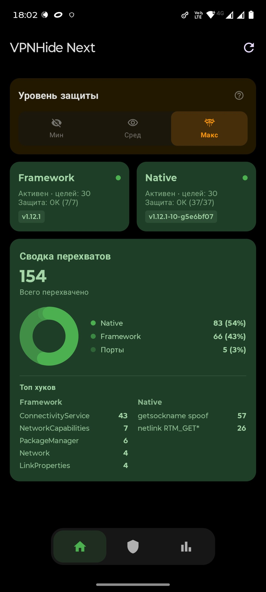
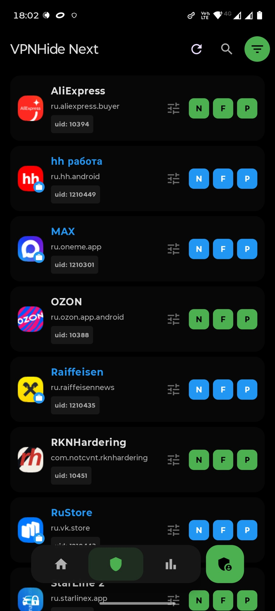
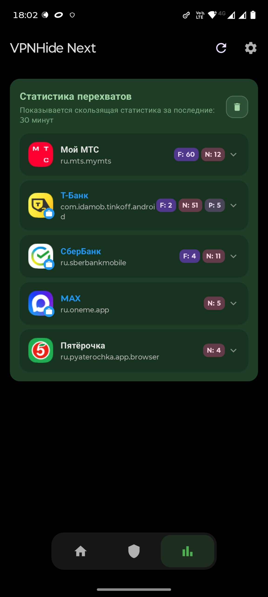
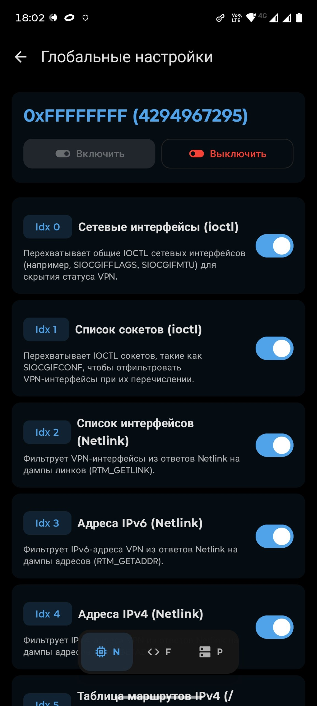
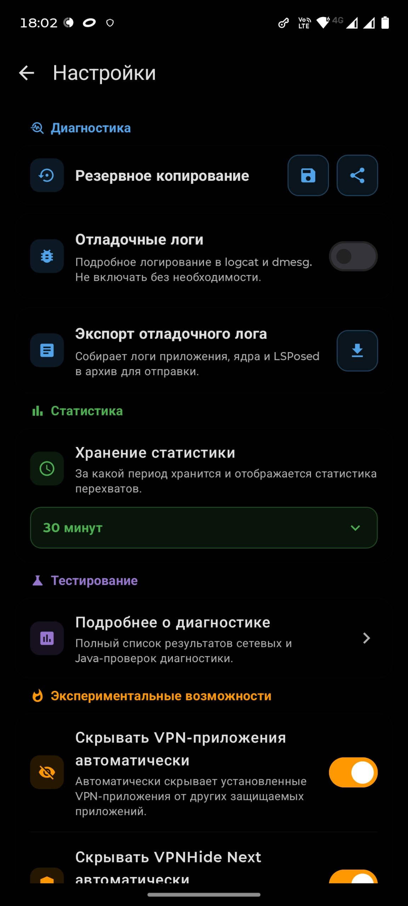
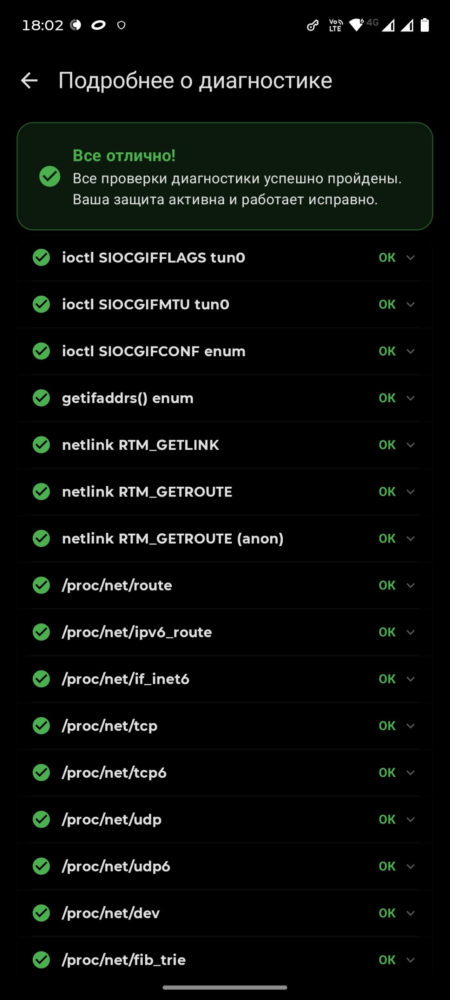

  

<h1 align="center">VPNHide Next</h1>

Системное решение для сокрытия активного VPN-соединения на устройствах Android от выбранных приложений.

  
  
  

<strong><a href="README.en.md">English version</a></strong>

> [!WARNING]
> **Требуется интеграция на уровне ядра и системного фреймворка**
> Стабильная работа на всех устройствах, прошивках и версиях ядер не гарантируется. ПО предоставляется «как есть» (AS IS) в соответствии с лицензией MIT. Автор не несёт ответственности за возможные сбои в работе устройства.

---

### Архитектура и методы интеграции

Проект реализует двухкомпонентную модель сокрытия, сочетающую перехват низкоуровневых системных вызовов в ядре и модификацию ответов системного фреймворка:

1. **Модуль ядра (LKM или Built-in)**:
   * **LKM (Loadable Kernel Module)**: Поставляется в виде загружаемого модуля ядра для ядер GKI (Android 12–17, версии 5.10–6.18). Для Android 17 / ядра 6.18 доступны публикация и автоматическое обновление модуля. Использует механизм `kretprobes` для перехвата сетевых вызовов и функций файловой системы.
   * **Built-in режим**: Интеграция логики сокрытия непосредственно в монолитное ядро на этапе сборки. Обеспечивает нулевой оверхед при вызовах, полную устойчивость к timing-атакам на системные вызовы и максимальную стабильность без необходимости загрузки внешних модулей в рантайме. Готовые билды доступны в репозиториях:
     * **Стандартные GKI2**: [GKI_KernelSU_SUSFS](https://github.com/soranerai/GKI_KernelSU_SUSFS)
2. **Модуль LSPosed**:
   * Перехватывает вызовы Binder API в процессе `system_server` (в частности, сериализацию Parcel для `NetworkCapabilities`, `NetworkInfo` и `LinkProperties`). Это исключает утечки информации о VPN через Java API без внедрения стороннего кода в целевые процессы приложений.

---

### Ключевые возможности

* **100% скрытность (built-in)**: Логика сокрытия компилируется непосредственно в ядро, исключая использование сторонних модулей и kretprobe-хуков. Это делает механизмы защиты неуязвимыми для timing-атак на системные вызовы (syscall) и полностью невидимыми для любых прикладных средств анализа и детектирования.
* **Безлимитное количество целей**: Механизм фильтрации поддерживает неограниченное число целевых приложений для сокрытия. Расчет эффективного списка UID выполняется динамически на стороне демона, предотвращая переполнение системного буфера.
* **Режимы списков (Blacklist / Whitelist)**:
  * *Черный список (Blacklist)*: Скрытие VPN-интерфейсов и сопутствующих параметров только от выбранных приложений.
  * *Белый список (Whitelist)*: VPN скрывается от всех установленных в системе приложений, за исключением явно выбранных в списке исключений.
* **Динамическое управление портами**: Блокировка и перенаправление трафика к портам локальных VPN-демонов на уровне хука ядра `security_socket_connect` / `security_socket_bind`. Правила портов задаются динамически без использования таблиц iptables и ProcFS.
* **Отслеживание обращений к портам**: Возможность мониторинга и фиксации того, к каким сетевым портам целевые приложения запрашивают доступ.
* **Динамическая настройка хуков**: Управление параметрами скрытия и переключение уровней защиты выполняются на лету через управляющее устройство `/dev/vpnhide_ctrl`. Изменения применяются без перезагрузки системы.
* **Автоматическое сокрытие управляющих приложений**: VPN-клиенты и менеджер управления сокрытием автоматически скрываются от целевых приложений в рантайме.
* **Поддержка рабочих профилей**: Корректное разделение логики сокрытия и применения списков между основным пользователем и изолированными рабочими профилями Android (Multi-user/Work Profile).

---

### Уровни защиты

Уровни защиты переключаются динамически через панель управления приложения и определяют набор активных хуков ядра:

| Уровень | Описание | Закрытые векторы обнаружения |
|---|---|---|
| **Минимальный (Min)** | Базовая сетевая изоляция | Фильтрация интерфейсов (`ioctl`, netlink), блокировка портов, скрытие маршрутов в `/proc/net/route`. |
| **Средний (Avg)** | Изоляция сокетов и сетевых параметров | Возможности уровня **Min** + перехват `getsockopt`/`setsockopt` (подмена MTU, MSS, `TCP_INFO`, `SO_BINDTODEVICE`, `SO_TIMESTAMPING`), предотвращение утечки меток сокетов (`SO_MARK`). |
| **Максимальный (Max)** | Полная системная изоляция | Возможности уровня **Avg** + скрытие файлов в `/proc/net/{dev,if_inet6,fib_trie}` и `/sys/class/net`, обнуление eBPF-статистики трафика, защита от UDP timing-атак и IPv6 link-local перебора, сокрытие VPN qdisc. |

---

### Диагностика и мониторинг

Приложение включает встроенный модуль диагностики, выполняющий **44 автоматизированные проверки** (37 проверок нативного уровня и 7 проверок Java-уровня), что позволяет верифицировать корректность сокрытия по всем известным векторам обнаружения.

Статистика перехватов накапливается демоном в кольцевом буфере памяти и считывается в реальном времени через абстрактный сокет `vpnhide.stats.v1`.

---

### Скриншоты

| Панель управления | Список приложений | Статистика |
|:-:|:-:|:-:|
|  |  |  |
| **Настройки хуков** | **Настройки приложения** | **Диагностика** |
|  |  |  |

---

### Благодарности

* [KernelSU](https://github.com/tiann/KernelSU) / [KernelSU-Next](https://github.com/rifsxd/KernelSU-Next) — за прекрасное рут-решение.
* [wildkernels](https://github.com/wildkernels) — за основу для built-in режима.
* [okhsunrog/vpnhide](https://github.com/okhsunrog/vpnhide) — за основу и вдохновение.
* [LSPosed](https://github.com/LSPosed/LSPosed) — за мощный фреймворк для перехвата API системного фреймворка.
* [SUSFS](https://gitlab.com/ephxius/susfs4ksu) — за концепцию скрытия файлов и путей в пространстве ядра.
